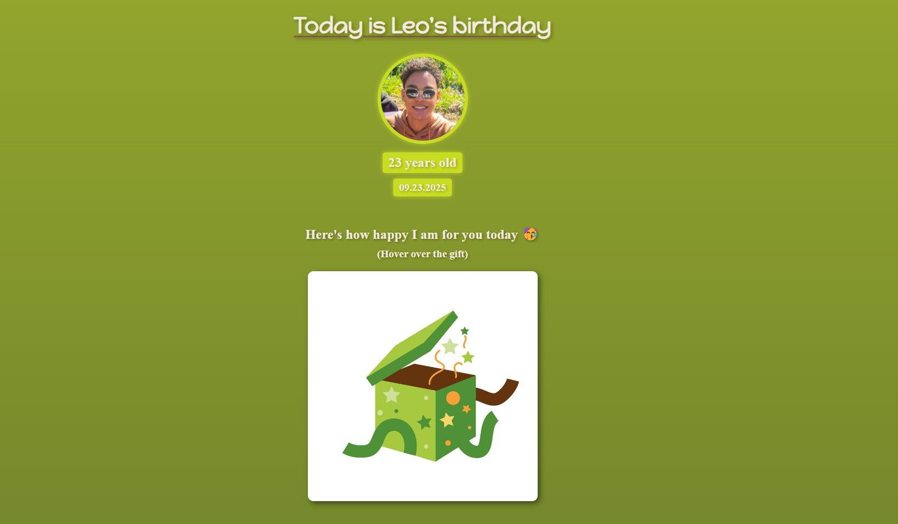

# Leo's Birthday Celebration 🎉

This project is a personalized webpage dedicated to celebrating Leo's birthday, highlighting special moments and unique characteristics that define him.



## Table of Contents

1. [Project Description](#project-description)
2. [Project Status](#project-status)
3. [Technologies Used](#technologies-used)
4. [Installation Guide](#installation-guide)
5. [Usage Instructions](#usage-instructions)
6. [Contributing](#contributing)
7. [License](#license)

## Project Description

The webpage features a festive design with sections dedicated to various aspects of Leo's personality and life. Each section includes images and descriptions that highlight his unique traits and favorite moments. Interactive elements, such as hover effects on images, enhance user engagement, creating a dynamic and enjoyable experience for visitors.

## Project Status

The project is complete and fully functional, currently in the maintenance phase. Future updates may include additional sections or content enhancements based on feedback and new ideas.

## Technologies Used

- **HTML5**: Structure and semantics of the webpage content.
- **CSS3**: Styling and responsive design implementation.

## Installation Guide

To set up the project locally:

1. **Clone the Repository**:

   ```bash
   git clone https://github.com/yourusername/leo-birthday-celebration.git


- Submit a Pull Request detailing your changes.

2. **Navigate to the Project Directory:**:
   
   ```bash
   cd leo-birthday-celebration

 ## Usage Instructions
 
The webpage is designed to be responsive and user-friendly. Upon opening index.html, visitors will see a central header with a birthday greeting for Leo, accompanied by a celebratory image. Scrolling down reveals sections that showcase Leo's age, birth date, and personalized messages. Hovering over certain images triggers animations, adding an interactive touch to the experience.​

## Contributing
Contributions are welcome to enhance the project. To contribute:​

- Fork the repository.

- Create a new branch ```(git checkout -b feature/your-feature)```.

- Implement your changes and commit them ```(git commit -am 'Add new feature')```.

- Push your changes to your fork ```(git push origin feature/your-feature)```.

- Submit a Pull Request detailing your changes.

Please ensure that your contributions align with the project's festive and celebratory theme.  
   
